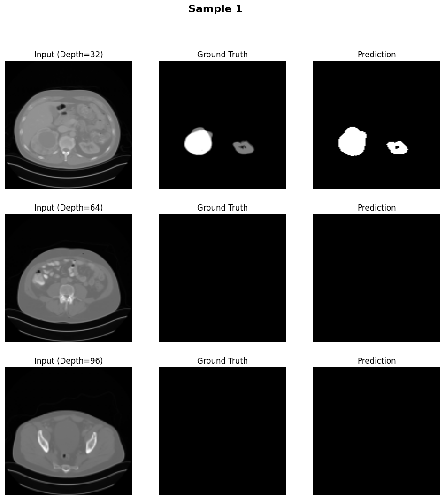
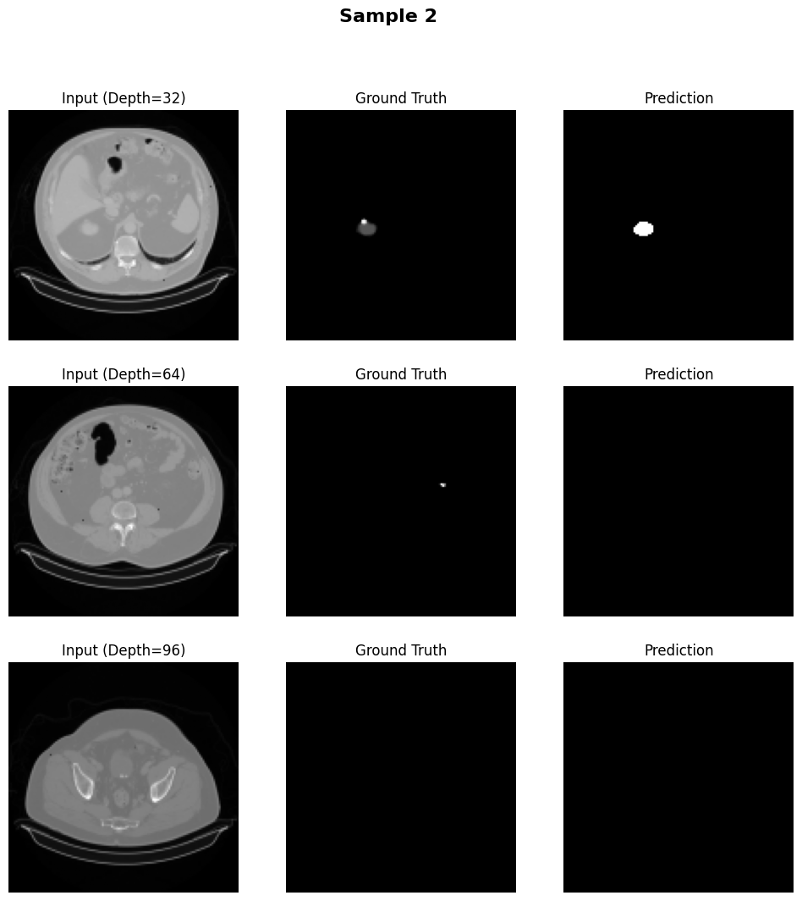

# 3D-U-Net 모델을 활용한 3D CT 영상 분할


## 🔹 프로젝트 구조

```
datasets/
    food101/
    ImageDataset.py
models/
    unet3d.py
utils/
    data_utils.py
    train.py
    test.py
    evaluate.py
    transform.py
    visualize.py
main.py
requirements.txt
Dockerfile
```
---
## 🔹 실행법 (for Local PC)

### ☝️ Requirements 설치

```
pip install -r requirements.txt
```

### ✌️ 실행

```
python main.py
```
---
## 🔹 도커 실행법 (for Docker User)

### ☝️ 도커 이미지 빌드

```
docker build -t kits23-unet3d .
```

### ✌️ 컨테이너 실행

```
docker run --rm kits23-unet3d
```

---

## 🔹 데이터셋

KiTS23  
KiTS23 데이터셋은 3D CT 의료 영상으로 총 489명의 환자 데이터를 포함하고 있습니다. 이 데이터셋은 신장, 종양 부위를 분할(segmentation)하는 데 적합합니다.
  
데이터셋은 별도의 준비 없이, 실행 시 `torchvision` 라이브러리를 통해 자동으로 다운로드됩니다.

---

## 🔹 결과

50 에포크 학습 후, 정확도:

```
Test Dice Score: 72.96%
```

예측 결과 예시:

  
  


---
소개 페이지: 
06unoh